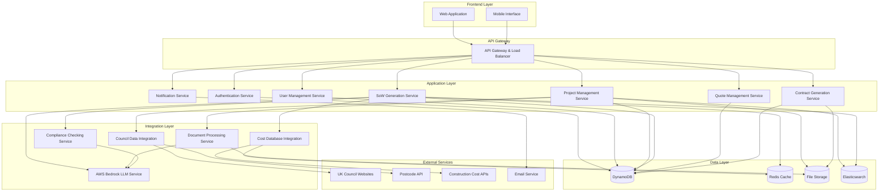

# Design Document

## Overview

The UK Home Improvement Platform is a web-based application that guides novice homeowners through the process of creating detailed, compliant Scopes of Work for home improvement projects. The system integrates with UK council databases, processes structural documents, and generates industry-standard documentation following RICS, NRM1/NRM2, RIBA Plan of Work, and NHBC standards.

The platform serves three primary user types: homeowners seeking project guidance, builders receiving and responding to SoWs, and administrators managing compliance and system operations.

## Architecture

### High-Level Architecture



### Technology Stack

**Frontend:**
- React.js with TypeScript for web application
- React Native for mobile interface
- Material-UI for consistent design system
- Redux Toolkit for state management

**Backend:**
- Node.js with Express.js framework
- TypeScript for type safety
- Microservices architecture with Docker containers
- API Gateway using Kong or AWS API Gateway

**Database:**
- DynamoDB for primary data storage with single-table design
- Redis for caching and session management
- Elasticsearch for document search and indexing
- AWS S3 for file storage

**Infrastructure:**
- AWS cloud hosting with full AWS service integration
- AWS Lambda for serverless compute and microservices
- AWS API Gateway for API management
- AWS Bedrock for LLM services (Claude, Titan models)
- AWS ECS/Fargate for containerized services
- CI/CD pipeline with AWS CodePipeline and GitHub Actions
- Monitoring with AWS CloudWatch and X-Ray

## Components and Interfaces

### Core Services

#### 1. User Management Service
**Responsibilities:**
- User registration and authentication
- Profile management for homeowners and builders
- Role-based access control
- GDPR compliance and data management

**Key APIs:**
- `POST /api/users/register` - User registration
- `POST /api/users/login` - Authentication
- `GET /api/users/profile` - Profile retrieval
- `PUT /api/users/profile` - Profile updates
- `DELETE /api/users/account` - Account deletion (GDPR)

#### 2. Project Management Service
**Responsibilities:**
- Project creation and lifecycle management
- Property address validation and council data lookup
- Document upload and processing
- Project progress tracking

**Key APIs:**
- `POST /api/projects` - Create new project
- `GET /api/projects/{id}` - Retrieve project details
- `PUT /api/projects/{id}` - Update project
- `POST /api/projects/{id}/documents` - Upload documents
- `GET /api/projects/{id}/council-data` - Get council restrictions

#### 3. SoW Generation Service
**Responsibilities:**
- Analyze project inputs and generate compliant SoWs using AI
- Apply RICS, NRM1/NRM2, RIBA, and NHBC standards
- Cost estimation using industry databases
- Template management for different project types
- AI-powered content generation and optimization

**Implementation:**
- AWS Bedrock (Claude 3.5 Sonnet) for intelligent SoW generation
- Custom prompts trained on UK construction standards
- Integration with document analysis for context-aware generation
- AI-powered cost estimation and material specification

**Key APIs:**
- `POST /api/sow/generate` - Generate SoW from project data using Bedrock
- `GET /api/sow/{id}` - Retrieve generated SoW
- `PUT /api/sow/{id}` - Update SoW
- `POST /api/sow/{id}/validate` - Validate compliance using AI

#### 4. Quote Management Service
**Responsibilities:**
- Distribute SoWs to selected builders
- Collect and manage builder quotes
- Quote comparison and analysis tools
- Builder communication management

**Key APIs:**
- `POST /api/quotes/distribute` - Send SoW to builders
- `POST /api/quotes` - Submit quote (builder endpoint)
- `GET /api/quotes/project/{id}` - Get quotes for project
- `POST /api/quotes/{id}/select` - Select winning quote

#### 5. Contract Generation Service
**Responsibilities:**
- Generate contracts from selected quotes
- Legal compliance with UK construction law
- Digital signature integration
- Contract version management

**Key APIs:**
- `POST /api/contracts/generate` - Generate contract
- `GET /api/contracts/{id}` - Retrieve contract
- `POST /api/contracts/{id}/sign` - Digital signature
- `GET /api/contracts/{id}/status` - Contract status

### Integration Components

#### AWS Bedrock LLM Service
**Responsibilities:**
- Intelligent document analysis and interpretation
- AI-powered SoW generation following UK standards
- Compliance checking with natural language explanations
- Cost estimation and material specification assistance
- User guidance and educational content generation

**Implementation:**
- Primary model: Claude 3.5 Sonnet for complex reasoning and analysis
- Secondary model: Amazon Titan for embeddings and search
- Custom prompt engineering for UK construction domain
- RAG (Retrieval Augmented Generation) with industry knowledge base
- Fine-tuned responses for RICS, NRM1/NRM2, RIBA, and NHBC standards
- Integration with document processing pipeline
- Real-time AI assistance for user queries

**Key Use Cases:**
- Analyze uploaded structural drawings and extract specifications
- Generate detailed SoWs based on project requirements
- Validate compliance against UK building regulations
- Provide plain English explanations of technical terms
- Suggest materials and methods based on project type
- Generate cost estimates with reasoning
- Create educational content for novice users

#### Council Data Integration Service
**Responsibilities:**
- Query council websites for planning restrictions
- Conservation area and listed building checks
- Planning permission requirement assessment
- Local authority contact information

**Implementation:**
- Web scraping for councils without APIs
- Direct API integration where available
- Cached results to minimize external calls
- Fallback to manual verification processes
- AWS Bedrock for intelligent parsing of council website data

#### Document Processing Service
**Responsibilities:**
- OCR processing of uploaded documents
- Structural drawing analysis using AI
- Document classification and metadata extraction
- Integration with compliance checking

**Implementation:**
- AWS Textract for OCR processing
- AWS Bedrock (Claude 3.5 Sonnet) for intelligent document analysis and interpretation
- Bedrock for extracting technical specifications from structural drawings
- Document versioning and audit trails
- Secure file handling and encryption

#### Compliance Checking Service
**Responsibilities:**
- Validate SoWs against building regulations using AI
- Check RICS, NRM1/NRM2, RIBA, NHBC compliance
- Flag potential issues and requirements
- Generate compliance reports

**Implementation:**
- AWS Bedrock (Claude 3.5 Sonnet) for intelligent compliance analysis
- Fine-tuned prompts with UK building regulations and industry standards
- Rule engine for regulation checking
- Regular updates to compliance databases
- Integration with industry standard libraries
- Automated compliance scoring with AI explanations

## Data Models

### DynamoDB Single-Table Design

The platform uses a single-table design pattern optimized for DynamoDB, with the following access patterns:

**Primary Key Structure:**
- **PK (Partition Key)**: Entity type and identifier (e.g., `USER#123`, `PROJECT#456`)
- **SK (Sort Key)**: Entity relationships and timestamps (e.g., `PROFILE`, `QUOTE#789`, `2024-01-15T10:30:00Z`)

**Global Secondary Indexes:**
- **GSI1**: `GSI1PK` (email for user lookup) / `GSI1SK` (user type)
- **GSI2**: `GSI2PK` (project status) / `GSI2SK` (created date)
- **GSI3**: `GSI3PK` (builder ID for quotes) / `GSI3SK` (quote status)

### Core Entities

#### User
```typescript
interface User {
  PK: string; // USER#{userId}
  SK: string; // PROFILE
  id: string;
  email: string;
  userType: 'homeowner' | 'builder' | 'admin';
  profile: UserProfile;
  createdAt: string; // ISO string
  updatedAt: string; // ISO string
  gdprConsent: boolean;
  emailVerified: boolean;
  GSI1PK: string; // email for lookup
  GSI1SK: string; // userType
}

interface UserProfile {
  firstName: string;
  lastName: string;
  phone?: string;
  address?: Address;
  companyName?: string; // For builders
  certifications?: string[]; // For builders
  insurance?: InsuranceDetails; // For builders
}
```

#### Project
```typescript
interface Project {
  PK: string; // PROJECT#{projectId}
  SK: string; // METADATA
  id: string;
  ownerId: string;
  propertyAddress: Address;
  projectType: ProjectType;
  status: ProjectStatus;
  requirements: ProjectRequirements;
  documents: Document[];
  councilData: CouncilData;
  sowId?: string;
  selectedQuoteId?: string;
  contractId?: string;
  createdAt: string; // ISO string
  updatedAt: string; // ISO string
  GSI2PK: string; // status for filtering
  GSI2SK: string; // createdAt for sorting
}

interface ProjectRequirements {
  description: string;
  dimensions: Dimensions;
  materials: MaterialPreferences;
  timeline: Timeline;
  budget: BudgetRange;
  specialRequirements: string[];
}

interface CouncilData {
  conservationArea: boolean;
  listedBuilding: boolean;
  planningRestrictions: string[];
  localAuthority: string;
  contactDetails: ContactInfo;
  lastChecked: string; // ISO string
}
```

#### Scope of Work (SoW)
```typescript
interface ScopeOfWork {
  PK: string; // SOW#{sowId}
  SK: string; // METADATA
  id: string;
  projectId: string;
  version: number;
  ribaStages: RibaStage[];
  specifications: Specification[];
  materials: MaterialList;
  costEstimate: CostEstimate;
  complianceChecks: ComplianceCheck[];
  generatedAt: string; // ISO string
  approvedAt?: string; // ISO string
  status: 'draft' | 'approved' | 'distributed';
}

interface RibaStage {
  stage: number; // 0-7
  title: string;
  description: string;
  deliverables: string[];
  duration: number; // days
  dependencies: string[];
}

interface CostEstimate {
  totalCost: number;
  breakdown: CostBreakdown[];
  methodology: 'NRM1' | 'NRM2';
  confidence: number; // percentage
  lastUpdated: string; // ISO string
}
```

#### Quote
```typescript
interface Quote {
  PK: string; // SOW#{sowId}
  SK: string; // QUOTE#{quoteId}
  id: string;
  sowId: string;
  builderId: string;
  totalPrice: number;
  breakdown: QuoteBreakdown[];
  timeline: number; // days
  warranty: WarrantyDetails;
  certifications: string[];
  terms: string;
  validUntil: string; // ISO string
  status: 'submitted' | 'selected' | 'rejected';
  submittedAt: string; // ISO string
  GSI3PK: string; // builderId for builder's quotes
  GSI3SK: string; // status#submittedAt for sorting
}
```

#### Contract
```typescript
interface Contract {
  PK: string; // CONTRACT#{contractId}
  SK: string; // METADATA
  id: string;
  projectId: string;
  quoteId: string;
  homeownerId: string;
  builderId: string;
  terms: ContractTerms;
  signatures: Signature[];
  status: 'draft' | 'signed' | 'active' | 'completed';
  createdAt: string; // ISO string
  signedAt?: string; // ISO string
}
```

### DynamoDB Access Patterns

1. **Get user by ID**: `PK = USER#{userId}`, `SK = PROFILE`
2. **Get user by email**: `GSI1PK = {email}`, `GSI1SK = {userType}`
3. **Get project details**: `PK = PROJECT#{projectId}`, `SK = METADATA`
4. **Get projects by status**: `GSI2PK = {status}`, `GSI2SK begins_with {date}`
5. **Get quotes for SoW**: `PK = SOW#{sowId}`, `SK begins_with QUOTE#`
6. **Get builder's quotes**: `GSI3PK = {builderId}`, `GSI3SK begins_with {status}`
7. **Get contract details**: `PK = CONTRACT#{contractId}`, `SK = METADATA`

## Error Handling

### Error Categories

1. **Validation Errors**: Input validation failures, missing required fields
2. **Integration Errors**: External API failures, council website unavailability
3. **Processing Errors**: Document processing failures, SoW generation issues
4. **Authorization Errors**: Access denied, expired tokens
5. **System Errors**: Database connectivity, service unavailability

### Error Response Format
```typescript
interface ErrorResponse {
  error: {
    code: string;
    message: string;
    details?: any;
    timestamp: Date;
    requestId: string;
  };
}
```

### Retry and Fallback Strategies

- **Council Data**: Retry with exponential backoff, fallback to cached data or manual verification
- **Document Processing**: Queue for retry, notify user of delays
- **Cost Estimation**: Use cached pricing data if APIs unavailable
- **Email Notifications**: Queue for retry, alternative notification methods

## Testing Strategy

### Unit Testing
- Service layer business logic
- Data model validation
- Utility functions and helpers
- Target: 90% code coverage

### Integration Testing
- API endpoint testing
- Database integration
- External service mocking
- End-to-end user workflows

### Performance Testing
- Load testing for concurrent users
- Document processing performance
- Database query optimization
- API response time benchmarks

### Security Testing
- Authentication and authorization
- Data encryption validation
- GDPR compliance verification
- Penetration testing

### Compliance Testing
- Building regulation validation
- Industry standard compliance (RICS, NRM1/NRM2, RIBA, NHBC)
- Legal requirement verification
- Accessibility compliance (WCAG 2.1)

### User Acceptance Testing
- Novice user journey validation
- Builder workflow testing
- Cross-browser compatibility
- Mobile responsiveness testing